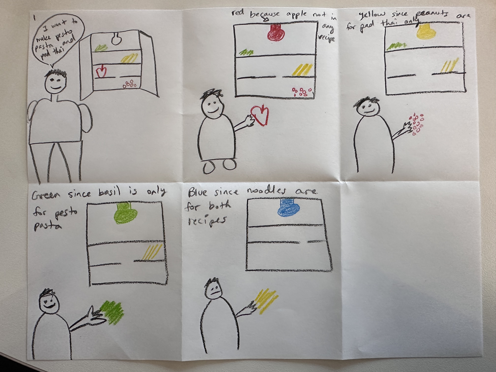
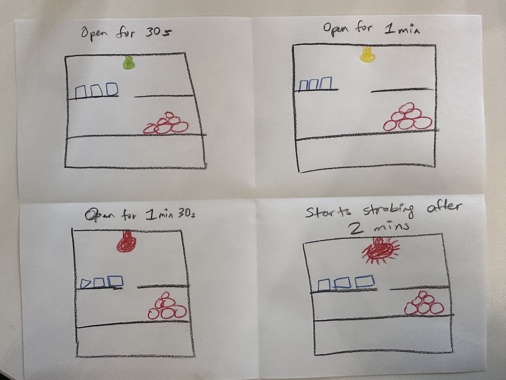
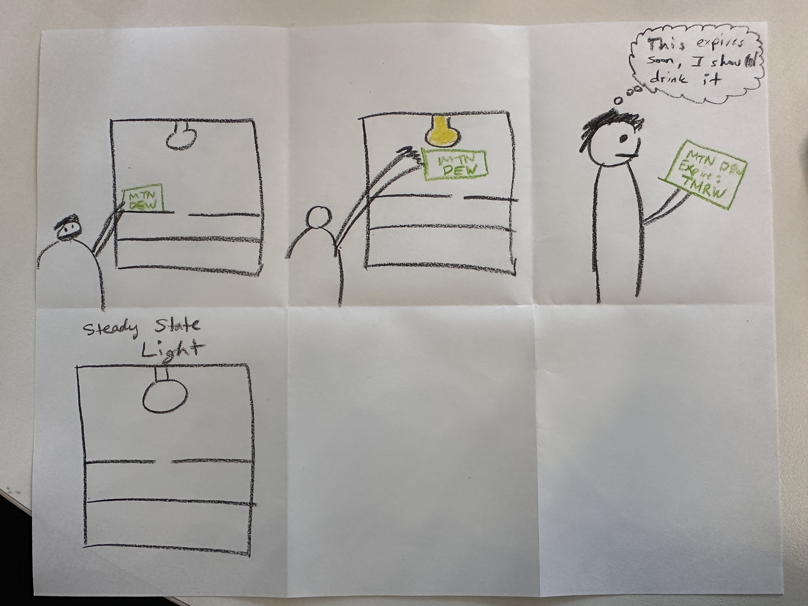
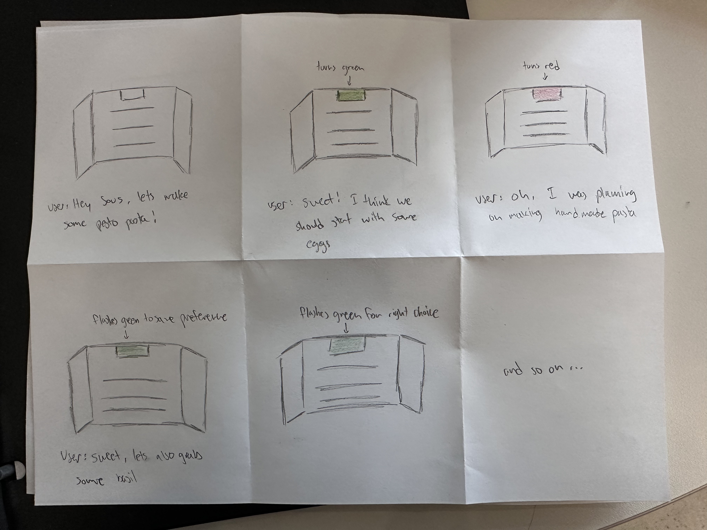
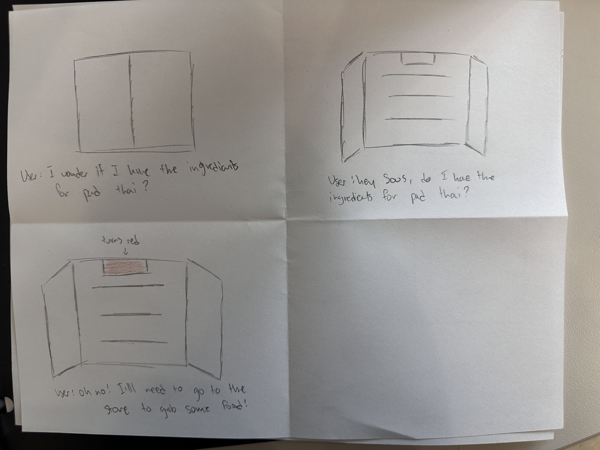
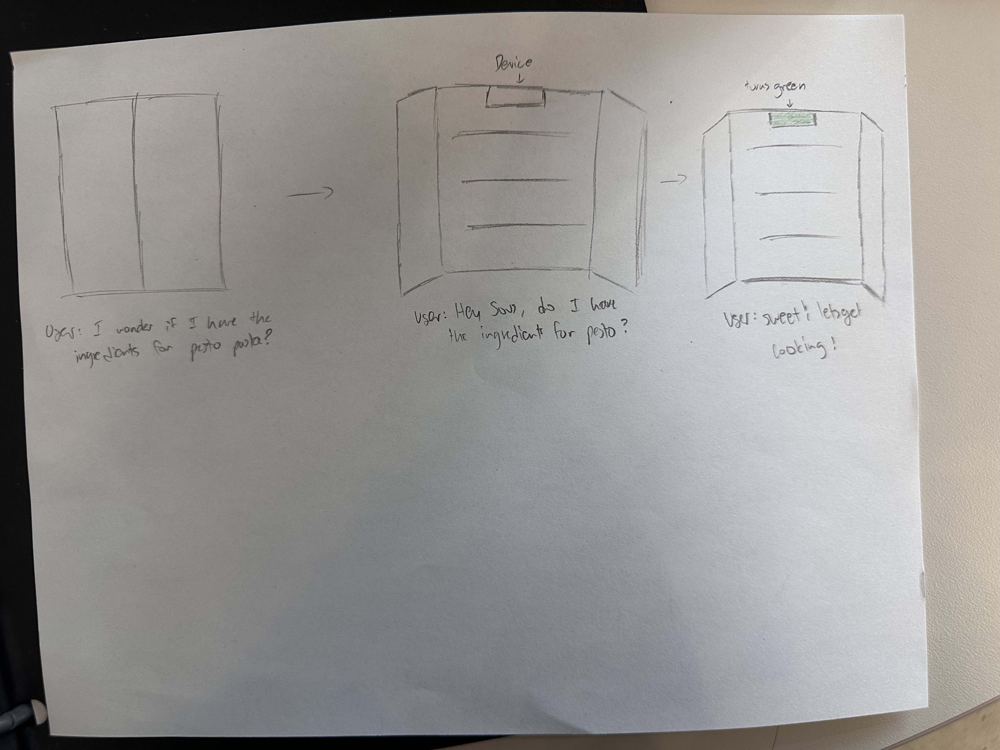
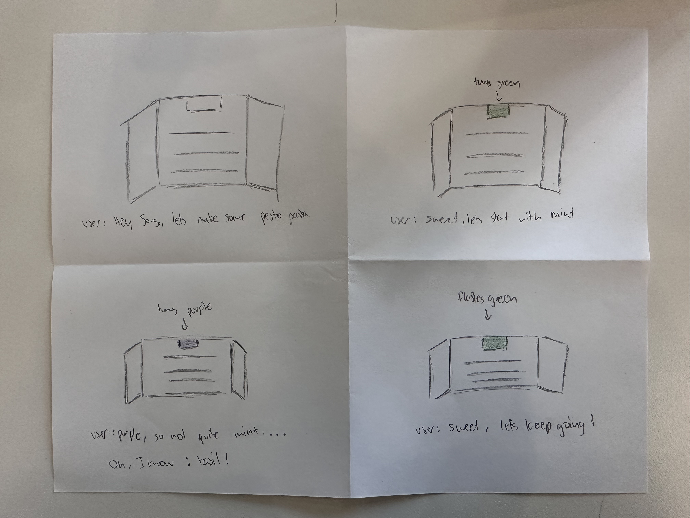
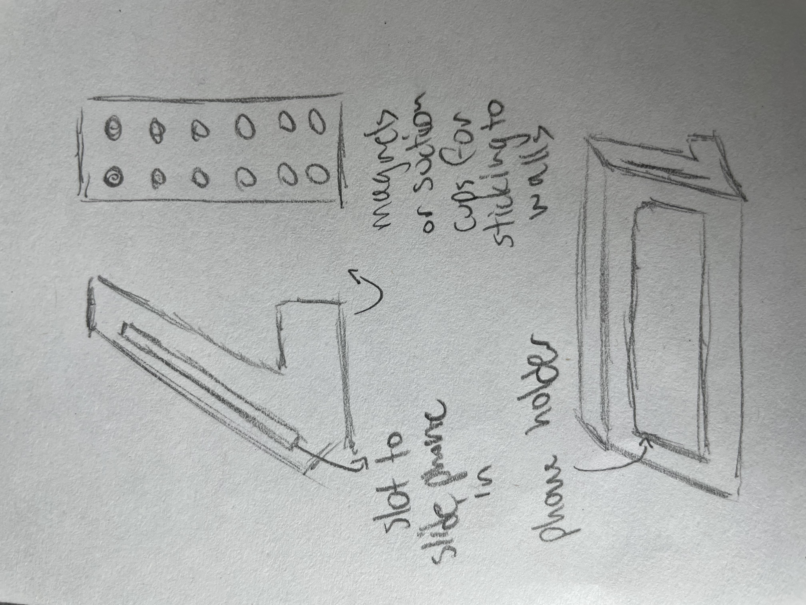
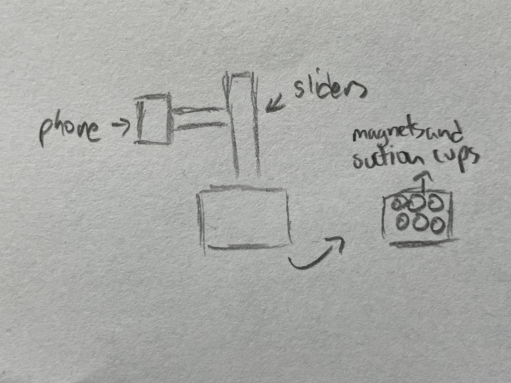

# Staging Interaction

Collaborator: **Nikhil Gangaram**

In the original stage production of Peter Pan, Tinker Bell was represented by a darting light created by a small handheld mirror off-stage, reflecting a little circle of light from a powerful lamp. Tinkerbell communicates her presence through this light to the other characters. See more info [here](https://en.wikipedia.org/wiki/Tinker_Bell). 

There is no actor that plays Tinkerbell--her existence in the play comes from the interactions that the other characters have with her.

For lab this week, we draw on this and other inspirations from theatre to stage interactions with a device where the main mode of display/output for the interactive device you are designing is lighting. You will plot the interaction with a storyboard, and use your computer and a smartphone to experiment with what the interactions will look and feel like. 

_Make sure you read all the instructions and understand the whole of the laboratory activity before starting!_

## Prep

### To start the semester, you will need:
1. Read about Git [here](https://git-scm.com/book/en/v2/Getting-Started-What-is-Git%3F).
2. Set up your own Github "Lab Hub" repository by forking the [Interactive-Lab-Hub repository](https://github.com/FAR-Lab/Interactive-Lab-Hub). To get lab updates, simply [use GitHub's "Sync fork" button when new content is available](https://docs.github.com/en/pull-requests/collaborating-with-pull-requests/working-with-forks/syncing-a-fork).

3. Set up the README.md for your Hub repository (for instance, so that it has your name and points to your own Lab 1). You can [learn how to organize and format your README.md here](https://docs.github.com/en/get-started/writing-on-github/getting-started-with-writing-and-formatting-on-github/basic-writing-and-formatting-syntax). Make sure to include links to your submissions so they are easy to find.

### For this lab, you will need:
1. Paper
2. Markers/ Pens
3. Scissors
4. Smart Phone -- The main required feature is that the phone needs to have a browser and display a webpage.
5. Computer -- We will use your computer to host a webpage which also features controls.
6. Found objects and materials -- You will have to costume your phone so that it looks like some other devices. These materials can include doll clothes, a paper lantern, a bottle, human clothes, a pillow case, etc. Be creative!

### Deliverables for this lab are: 
1. 7 Storyboards
1. 3 Sketches/photos of costumed devices
1. Any reflections you have on the process
1. Video sketch of 3 prototyped interactions
1. Submit the items above in the lab1 folder of your class [Github page], either as links or uploaded files. Each group member should post their own copy of the work to their own Lab Hub, even if some of the work is the same from each person in the group.

### The Report
This README.md page in your own repository should be edited to include the work you have done (the deliverables mentioned above). Following the format below, you can delete everything but the headers and the sections between the **stars**. Write the answers to the questions under the starred sentences. Include any material that explains what you did in this lab hub folder, and link it in your README.md for the lab.

## Lab Overview
For this assignment, you are going to:

A) [Plan](#part-a-plan) 

B) [Act out the interaction](#part-b-act-out-the-interaction) 

C) [Prototype the device](#part-c-prototype-the-device)

D) [Wizard the device](#part-d-wizard-the-device) 

E) [Costume the device](#part-e-costume-the-device)

F) [Record the interaction](#part-f-record)

Labs are due on Mondays. Make sure this page is linked to on your main class hub page.

## Part A. Plan 

To stage an interaction with your interactive device, think about:

_Setting:_ Where is this interaction happening? (e.g., a jungle, the kitchen) When is it happening?

_Players:_ Who is involved in the interaction? Who else is there? If you reflect on the design of current day interactive devices like the Amazon Alexa, it’s clear they didn’t take into account people who had roommates, or the presence of children. Think through all the people who are in the setting.

_Activity:_ What is happening between the actors?

_Goals:_ What are the goals of each player? (e.g., jumping to a tree, opening the fridge). 

The interactive device can be anything *except* a computer, a tablet computer or a smart phone, but the main way it interacts needs to be using light.

\*\***Describe your setting, players, activity and goals here.**\*\*

The setting of our interactive device is a house or apartment that has a fridge that is used by the residents to cook meals. It is not meant to be used in situations such as commercial kitchens with fridges. The players involved in the interaction are the residents of the apartment or house, there will be other people such as guests, but since the device is located inside of the fridge, it is typically only used by 1 person at a time. The activity is that the resident is interested in cooking a meal and wants to know if they have the correct ingredients, whether the ingredients are still within their expiration date, and if there is any substitutes that can be made with specific items in the fridge. The goal of each player is to make whichever meal they would like in an easy way and keep track of their ingredients.

Storyboards are a tool for visually exploring a users interaction with a device. They are a fast and cheap method to understand user flow, and iterate on a design before attempting to build on it. Take some time to read through this explanation of [storyboarding in UX design](https://www.smashingmagazine.com/2017/10/storyboarding-ux-design/). Sketch seven storyboards of the interactions you are planning. **It does not need to be perfect**, but must get across the behavior of the interactive device and the other characters in the scene. 

\*\***Include pictures of your storyboards here**\*\*

Present your ideas to the other people in your breakout room (or in small groups). You can just get feedback from one another or you can work together on the other parts of the lab.

\*\***Summarize feedback you got here.**\*\*

We got great feedback from others regarding the idea. They thought that it was an interesting concept that could help reduce food waste and help people learn how to cook. Some specific feedback that we received were to add sound/voice so that the device became even more interactive. In addition, another piece of feedback that we were given is to figure out a way to indicate the quantities of items. In our current use case, there is no way to tell the user how much of each item that they need for their recipe, and this is something we will try to add in the future. Finally, we received feedback that the device might not be nuanced enough. For example, someone could make pasta with eggs and flour, or with just uncooked pasta, but the interactive device might not be able to understand this. We would like the fix this in further versions of the device.

## Part B. Act out the Interaction

Try physically acting out the interaction you planned. For now, you can just pretend the device is doing the things you’ve scripted for it. 

\*\***Are there things that seemed better on paper than acted out?**\*\*

Yes. A few things that seemed better on paper rather than acted out is all of the different flashing colors which indicated specific things. When actually grabbing different ingredients, it was confusing to see what the colors meant for example, yellow for expiring soon, purple for close, but not the right ingredient, and flashing vs steady lights. It gets a little complicated and has a learning curve. Another problem was with asking which recipes can be made with the ingredients in the fridge. The first problem was trying to figure out how the device would even know what ingredients there were, second, what happens when there is a partial match, and third, it takes a long time to get the ingredients out once you know you can make a recipe, especially with a full fridge. In addition, I found it awkward and unnatural to talk to the fridge, but that could be more intuitive for some people more than others.

\*\***Are there new ideas that occur to you or your collaborator that come up from the acting?**\*\*

Some ideas that occured to myself and my collaborator was to integrate the device with apps like Instacart, DoorDash, UberEats, etc., so that the device can automatically add to a grocery list when there are missing ingredients. In addition, rather than having a single light indicating if the ingredient that was picked is correct, we could integrate a progress bar, which would allow users to know if they are close to finishing the gathering of ingredients. In addition, this device could integrate with a phone and send reminders if ingredients are running low or expiring. While this last idea strays from the simplicity of our current device, it is still a future posssibility.

## Part C. Prototype the device

You will be using your smartphone as a stand-in for the device you are prototyping. You will use the browser of your smart phone to act as a “light” and use a remote control interface to remotely change the light on that device. 

Code for the "Tinkerbelle" tool, and instructions for setting up the server and your phone are [here](https://github.com/IRL-CT/tinkerbelle).

We invented this tool for this lab! 

If you run into technical issues with this tool, you can also use a light switch, dimmer, etc. that you can can manually or remotely control.

\*\***Give us feedback on Tinkerbelle.**\*\*

Tinkerbelle looks great and it is designed super well. It is intuitive and easy to set up. The only feedback that I have is that for our scenario of prototyping the device, since my partner and I were in different locations, as I commute from Long Island and he lives on campus, we were not able to meet and work on the prototype videos together. Therefore, since you need to be on the same Wi-Fi to use Tinkerbelle, we had to explore other opportunities. Overall, super well built.

## Part D. Wizard the device
Take a little time to set up the wizarding set-up that allows for someone to remotely control the device while someone acts with it. Hint: You can use Zoom to record videos, and you can pin someone’s video feed if that is the scene which you want to record. 

\*\***Include your first attempts at recording the set-up video here.**\*\*

I am not able to embed the video into this markdown file, but I put the video in the "Interactions" folder with the name of "first_attempt.mov".

Now, change the goal within the same setting, and update the interaction with the paper prototype. 

\*\***Show the follow-up work here.**\*\*

I am not able to embed the video into this markdown file, but I put the video in the "Interactions" folder with the name of "prototype_1.mov".

## Part E. Costume the device

Only now should you start worrying about what the device should look like. Develop three costumes so that you can use your phone as this device.

Think about the setting of the device: is the environment a place where the device could overheat? Is water a danger? Does it need to have bright colors in an emergency setting?

\*\***Include sketches of what your devices might look like here.**\*\*

\*\***What concerns or opportunitities are influencing the way you've designed the device to look?**\*\*

Some concerns that are influencing the way we designed the device is fridge space and the temperature in the fridge. We tried to make the designs take up the least amount of space and even camoflage with it's environment so that it would be easy for users to integrate it into their fridge.

## Part F. Record

\*\***Take a video of your prototyped interaction.**\*\*

I am not able to embed the video into this markdown file, but I put the prototyped interaction videos in the "Interactions" folder with the names of "prototype_1.mov", "prototype_2.mov", and "prototype_3.mov".

\*\***Please indicate who you collaborated with on this Lab.**\*\*
Be generous in acknowledging their contributions! And also recognizing any other influences (e.g. from YouTube, Github, Twitter) that informed your design. 

I worked with Nikhil Gangaram. He helped out tremendously and the idea for this device was his. We worked together closely to make the storyboards, get feedback, and create the videos. He put in a lot of time to make the costumes and was a great partner. We took some inspiration from Duolingo and how they teach with reinforcement learning.

# Staging Interaction, Part 2 

This describes the second week's work for this lab activity.

## Prep (to be done before Lab on Wednesday)

You will be assigned three partners from other groups. Go to their github pages, view their videos, and provide them with reactions, suggestions & feedback: explain to them what you saw happening in their video. Guess the scene and the goals of the character. Ask them about anything that wasn’t clear. 

\*\***Summarize feedback from your partners here.**\*\*

## Make it your own

Do last week’s assignment again, but this time: 
1) It doesn’t have to (just) use light, 
2) You can use any modality (e.g., vibration, sound) to prototype the behaviors! Again, be creative! Feel free to fork and modify the tinkerbell code! 
3) We will be grading with an emphasis on creativity. 

\*\***Document everything here. (Particularly, we would like to see the storyboard and video, although photos of the prototype are also great.)**\*\*
