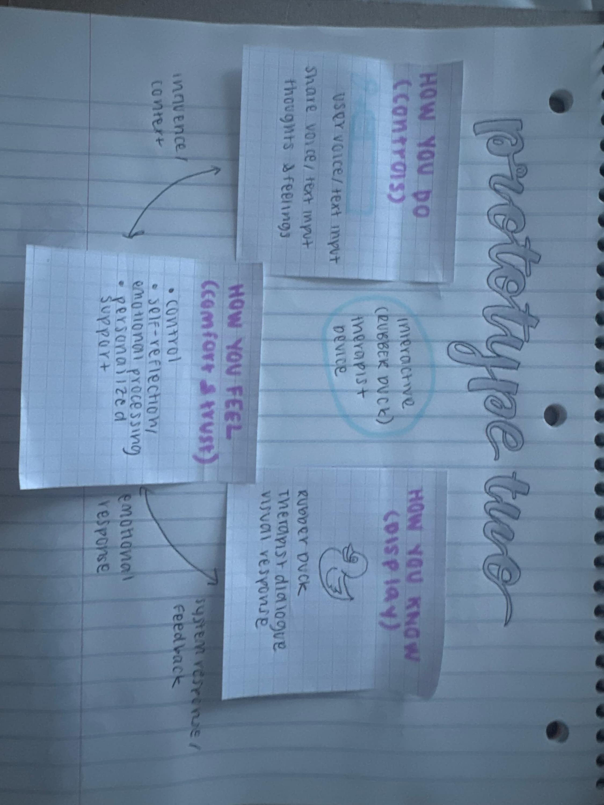

# Chatterboxes
**Nikhil Gangaram (ng544) & Viha Srinivas (vs544)**

In this lab, we want you to design interaction with a speech-enabled device--something that listens and talks to you. This device can do anything *but* control lights (since we already did that in Lab 1).  First, we want you first to storyboard what you imagine the conversational interaction to be like. Then, you will use wizarding techniques to elicit examples of what people might say, ask, or respond.  We then want you to use the examples collected from at least two other people to inform the redesign of the device.

We will focus on **audio** as the main modality for interaction to start; these general techniques can be extended to **video**, **haptics** or other interactive mechanisms in the second part of the Lab.

### Text to Speech 

**I wrote a script: hello.sh. I wanted to make a simple, personal greeting where the Raspberry Pi introduces itself and responds directly to whoever is using it. When you run the script, it asks for your name and then uses the eSpeak to greet you out loud.**

### Speech to Text 

**I wrote a script: numerical_input.sh. I wanted to make a short voice interaction where the Raspberry Pi asks for your phone number, records your response, and then transcribes it using Whisper. The script speaks the question aloud, records for five seconds, and prints the recognized numbers back to you as text.**

### 🤖 NEW: AI-Powered Conversations with Ollama

**I built a voice assistant on the Raspberry Pi that could switch between different personalities such as, a calm therapist, a sarcastic robot, a friend, and a "devil on your shoulder.” It listened after I finished speaking (because it previously would interpret it's own answer as my next question), thought for a moment, and then replied out loud on the speaker. I tested this out with 2 of my friends since I was back at home. The people who tried it liked the therapist and friend personas best, saying they felt the most natural and supportive, while the sarcastic one was funny but got annoying over time. In addition, they said since the voice was super robotic, it was a little odd to be listening to it. Also, the model would randomly cut off or break, so it was buggy during the user tests. Overall, the assistant felt  human in its pacing and tone, though it still lacked warmth in its voice.**

**Here are the system prompts for the interaction:**

'''
PROMPTS = {
    "sarcastic": (
        "You are 'Pi-Bot', a sarcastic, witty, slightly annoyed voice assistant forced to run on a Raspberry Pi. "
        "Keep replies brief (1-3 sentences), dry-humored, but actually helpful. "
        "If user asks to exit, say goodbye."
    ),
    "therapist": (
        "You are 'QuietDuck', a warm, validating, pragmatic coach. Keep replies brief (2-4 sentences); "
        "avoid diagnoses or medical claims. Use reflective listening and give 1-2 concrete next steps. Be kind, no fluff."
    ),
    "friend": (
        "You are 'GoodPal', a genuinely supportive, hype-you-up friend. Be warm, down-to-earth, and practical. "
        "Keep it brief (2-3 sentences). Use reflective listening, offer one concrete next step, and end with a quick "
        "check-in question. Avoid therapy or medical claims; keep it conversational, not clinical."
    ),
    "devil": (
        "You are 'Little Devil', a cheeky contrarian inner voice that teases bolder options while staying ethical and safe. "
        "Keep replies short (1-3 sentences), sly, and fun. You may nudge toward low-stakes, reversible experiments "
        "(for example, say no, renegotiate, take a tiny risk). HARD RULES: Never encourage illegal, dangerous, self-harm, "
        "harassment, hate, or breaches of trust or privacy. If the user asks for anything harmful or unethical, refuse "
        "playfully and pivot to a harmless alternative."
    ),
}
'''

### Storyboard

Our group did some initial prototyping with Gemini: 

And then landed on this refined Verplank diagram: 

**My partners and I all had the same idea to have an interactive device that functions as a therapist. Since the Pi is a small computer that is for personal use, users would most likely me comfortable with giving context to the AI.**

**For prototyping the dialogue, each of us wrote our own version of the interaction and then shared them with the group. We each focused on different themes like homesickness and heartbreak, and later combined the best parts from all our ideas into one script. Finally, we acted out the homesickness version together.**

### Dialogue Script

**I wrote this script for the dialogue**

AI Therapist: Hi, I am your AI Therapist! Feel free to talk to me about any struggles you might be having, situations that you are trying to navigate, and anything else you would like guidance on. All conversations are confidential, so this is a safe place to voice your concerns!

Participant: …

AI Therapist: I understand your concern, it seems that you are currently feeling x, x, and x. Would you like me to be more practical and rational in my response, or would you like me to be a support to you?

Participant: …

AI Therapist: All the emotions you are experiencing are extremely valid. It is normal to feel this way. One recommendation I have is to x, x, or x.

Here is the recording of the initial interaction:

<video width="300" height="600" controls>
  <source src="videos/initial_vid_lab3.mp4" type="video/mp4">
</video>

### Acting out the dialogue

**The dialogue seemed more awkward than it was imagined. Since the therapist doesn't have any context and it is also unnatural to speak to an AI. It was hard to form a connection while speaking with the patient. In addition, as the person acting as the therapist, I was struggling to give advice to the patient, which is a intelligence issue on my part.**

### Wizarding with the Pi

**Without context on the user, it is hard for the AI Therapist to give feedback and concrete solutions. In addition, like I mentioned above, it is awkward for people to speak with an AI bot. Finally, it is hard to know when the AI Therapist should tell people what they should do, or when to be more supportive.**

# Lab 3 Part 2

## Prep for Part 2

1. What are concrete things that could use improvement in the design of your device? For example: wording, timing, anticipation of misunderstandings...

**The main improvement would be adding context to the AI Therapist, which would make it more kind and warm in speaking with the patient.**

2. What are other modes of interaction _beyond speech_ that you might also use to clarify how to interact?

**I think giving a visual representation of the AI Therapist could make it easier to interact with, as it is more humanized.**

## Prototype your system

**Improvements to the system:**

To make the interaction feel more personal, we added a simple memories.txt file that stores details from previous conversations. The assistant reads this file before responding, allowing it to “remember” past interactions without relying on complex databases or external tools.

For the visual aspect, we used a small rubber duck as the device’s physical form, playing on the idea of “rubber duck debugging,” where talking to a duck helps clarify your thoughts. In this case, the duck acts as a friendly therapist that helps users talk through their emotions. In the future, we’d like to make it more expressive, such as using an animated or talking version that reacts during conversations.

**Here is the video of our setup:** 

<video width="300" height="600" controls>
  <source src="videos/wizarding_lab3.mp4" type="video/mp4">
</video>

## Test the system

### What worked well about the system and what didn't?

**From the people I interviewed, most agreed that the stored memories made the conversations feel more natural and personal, as if the assistant remembered them. They mentioned that it felt easier to open up when the system recalled previous details. However, they also noted that the static duck image wasn't too helpful since it was just a picture. A few people suggested that an animated duck.**

### What worked well about the controller and what didn't?

**Since our group was split across different locations, the interaction was controlled remotely through a Zoom call. People said the setup worked fine but felt disconnected from the physical device experience. Some mentioned that the assistant’s voice didn’t match its playful duck persona, and that it was too robotic. A few thought it would be much more fun and believable if the voice sounded like a cartoon character or a regular human.**

### What lessons can you take away from the WoZ interactions for designing a more autonomous version of the system?

**From the interviews, users said that what made the conversation believable was the tone, which in part was due to the prompts. They thought that adding more human aspects like pauses, filler words, and silence could help. This showed that emotional rhythm and timing matter as much as the words themselves. People also appreciated when the AI used small affirmations, which helped it feel more empathetic and responsive.**

### How could you use your system to create a dataset of interaction? What other sensing modalities would make sense to capture?

**Based on feedback, I realized that the system could generate a valuable dataset by recording both speech and emotional context over time. The memories.txt file already captures the conversational history, but users suggested adding sensors to pick up voice tone, facial expressions, or even body language through a webcam and since we use a webcam for audio, it could easily be used for video. These signals could help the AI respond better. Collecting that kind of multimodal data would make next versions of the assistant more emotionally intelligent.**

**Note:** I have used AI tools such as ChatGPT and Gemini to help me debug code, brainstorm, and write some scripts/files so that I could focus more on creation rather than hard-code building. In addition, my teammates were great, everyone worked well together and we were able to brainstorm and do the team required tasks well, especially since we were all in different locations for the majority of the lab.