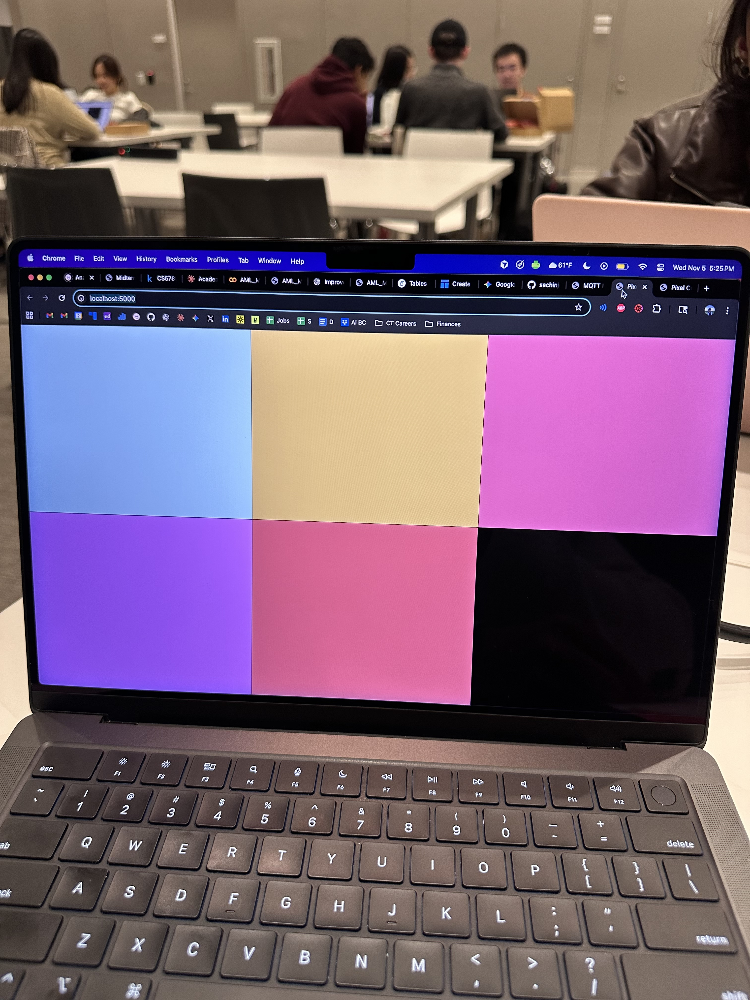
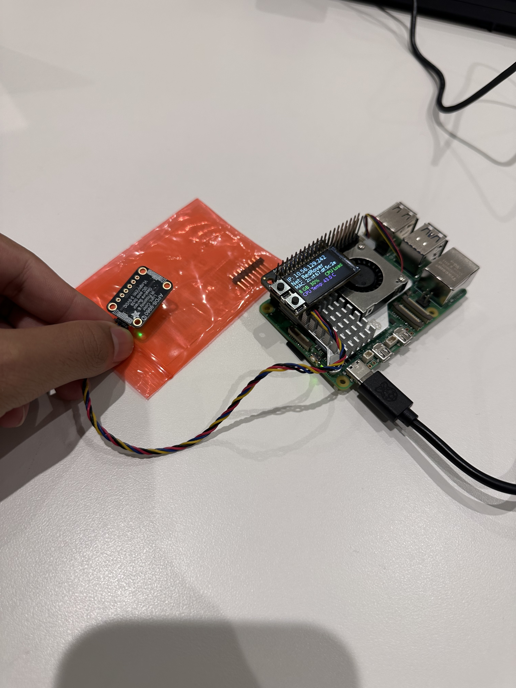
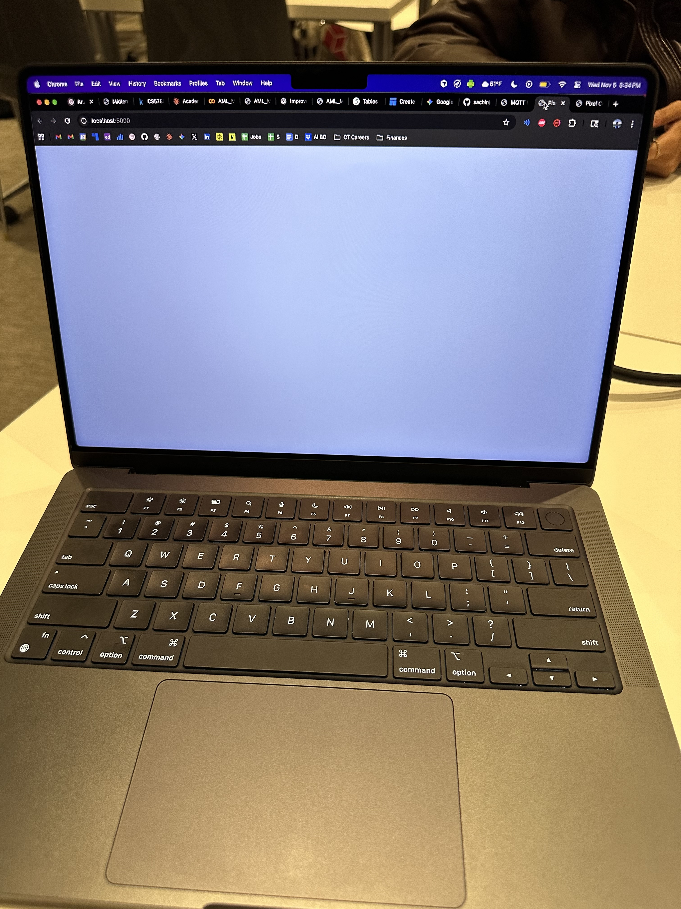
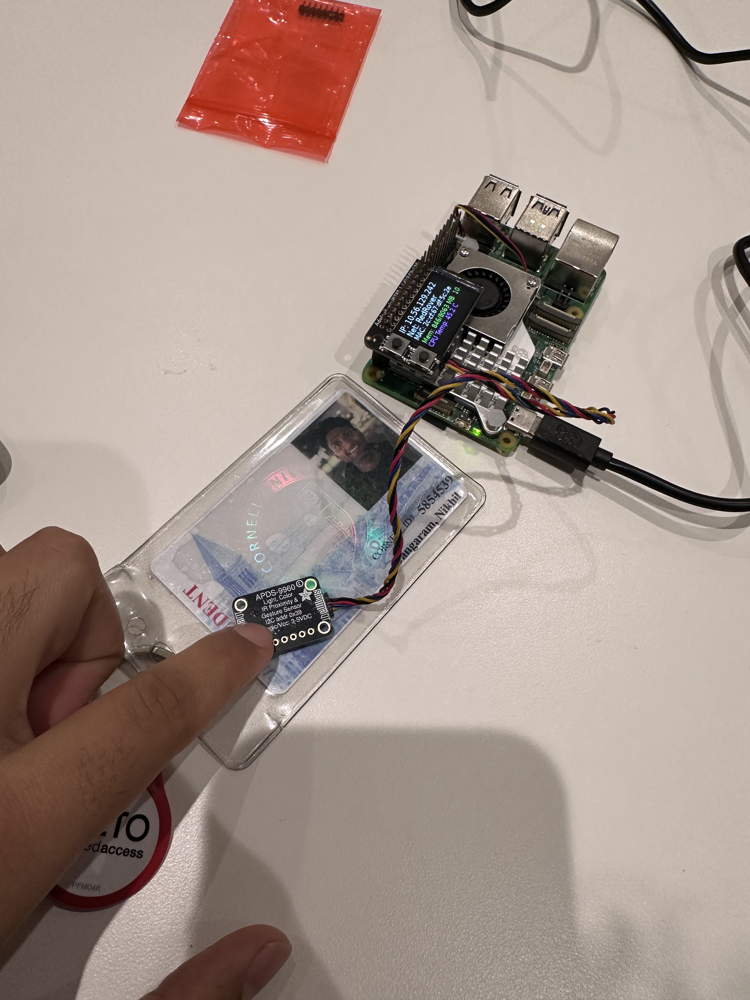

# Distributed Interaction

**Nikhil Gangaram (ng544), Viha Srinivas (vs544), Arya Prasad (ap2535)**

## Part A: MQTT Messaging

**💡 Brainstorm 5 ideas for messaging between devices**

- Talk with Your Hands (Gesture Communicator): Imagine one Pi is watching someone who can't easily talk or hear. When they make a hand sign (like in sign language), the Pi recognizes it and sends a simple message to the others. The other Pis then light up or show text, acting as simple helpers for communication across the house.

- The Three-Part Singing Crew (Harmony Maker): You sing into one Pi, and instantly, the other two Pis act like backup singers. They each take your voice and play it back slightly higher and slightly lower, making it sound like you have a three-person choir. It's a way to use the network to share and process sound in real time.

- House Party Lights (Digital Disco): This turns your Pis into party starters. One Pi listens for loud noises or clapping, and another watches for people dancing or moving around. They quickly tell the third Pi how active things are, and all the lights flash and change colors together, making the atmosphere match the fun.

- "What Do We Need?" Kitchen Checker (Inventory Helper): You point the cameras at different storage spots—like the pantry shelf and the fridge. The Pis quietly watch what's there and what's missing. If you run out of milk or bread, they send you a simple alert, saving you a trip to the store.

- The Three-Eye Watchdog (Distributed Security): You put the three cameras in important spots, like the front door and the backyard. If one camera sees any unexpected movement, it immediately shouts a warning across the network. The third Pi acts as the main alarm box, setting off a big flash on all the lights to let everyone know something is wrong in the house.

---

## Part B: Collaborative Pixel Grid

**📸 Include: Screenshot of grid + photo of your Pi setup**

---

## Part C: Make Your Own

**1. Project Description**

We've chosen to build towards our final project by building the gesture controlled modules. The idea is to use cheaper computers (raspberry pi's) to communicate with a larger computer (our laptops) to update a global state in an accessible way. Specifically, we've chosen to encode two gestures akin to ASL that a user can input to change the global consensus between devices. In this case, we've chosen to have two gestures that cycle through colors of the rainbow in different directions. 

**2. Architecture Diagram**

**3. Build Documentation**

We broke our process down into 3 main steps : pi-pi communication, gesture control, and then integration. Here are the 3 videos for each part:

[Pi-Pi Communication](https://youtu.be/l3sK-Un6r_g)
[Gesture Control](https://youtube.com/shorts/ilUMCtHcV4I?feature=share)
[Integration](https://youtube.com/shorts/WWuHhcyBsaM?feature=share)

**4. User Testing**
- **Test with 2+ people NOT on your team**
- Photos/video of use
- What did they think before trying?
- What surprised them?
- What would they change?

[Steph's Demo](TODO)

Sachin's girlfriend, Thirandi, was visitng and also tried the system. She wasn't comfortable being on camera but thought it was a fun idea. She mentioned that the latency made the system feel unfinished as it wasn't an instantaenous cahnge. Also, she mentioned that the number of gestures being so few was unintuitive. 

**5. Reflection**
- What worked well?
- Challenges with distributed interaction?
- How did sensor events work?
- What would you improve?

The software modules that we developed were quite stable due to the technology being proven and tested. However, the early stages of the computer vision pipeline were quite jumpy and didn't always get the right action from the user (huge shoutout to Arya for refining that pipeline). The sensor events are triggers from the camera which then percolate through the MQTT network to update the other pi's. 

---

## AI / Team Contributions 

* Gemini was very helpful during the initial ideation phases. While we came up with the ideas, it was helpful in creating the write up. Also, we used it to refine and create the images for the sketch and software diagram for the control flow (as well as to develop the code). 
* All team members helped in both the ideation and software development stages of this project. 